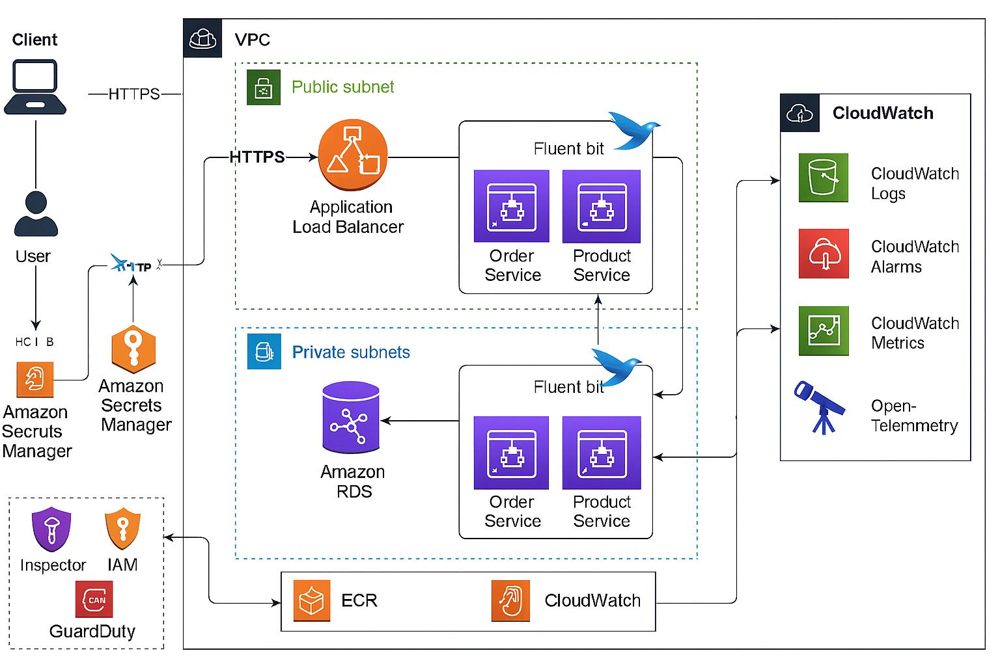
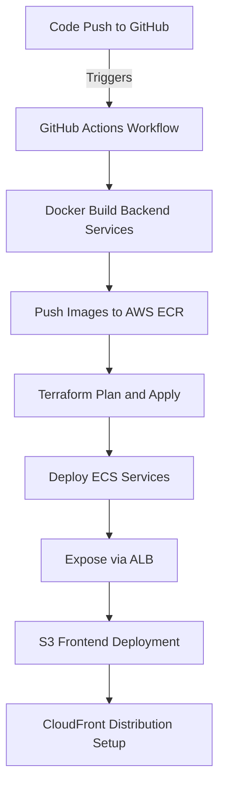

# CloudNova - Cloud Native Microservices Platform

## Overview
CloudNova is a modern **cloud-native microservices application** built on AWS. It implements end-to-end DevOps practices including CI/CD, Blue-Green deployment, centralized logging, security hardening, disaster recovery, and observability.

---

## 🚀 Project Architecture

### Core Components:
- **Frontend:** React App (deployed to S3 + CloudFront)
- **Backend:** GoLang Microservices (Order, Product, User services)
- **Infrastructure:** ECS Fargate, ALB, VPC, Security Groups, Subnets
- **CI/CD:** GitHub Actions
- **Monitoring:** FluentBit, CloudWatch Logs, Metrics, Alarms
- **Security:** AWS Inspector, GuardDuty, Secrets Manager
- **Resilience:** Auto-recovery Alarms, Multi-AZ Deployment

---

## 📦 Tools and Technologies

| Layer                  | Tools Used                                                                 |
|------------------------|----------------------------------------------------------------------------|
| Source Control         | GitHub                                                                    |
| CI/CD                  | GitHub Actions, ECR                                                       |
| Compute                | ECS Fargate                                                               |
| Networking             | VPC, Public and Private Subnets, NAT Gateway, ALB                        |
| Observability          | FluentBit, CloudWatch Logs, CloudWatch Metrics, CloudWatch Alarms         |
| Security               | AWS Inspector, GuardDuty, Secrets Manager, IAM, Security Groups          |
| Storage                | S3 (Frontend Hosting)                                                     |
| Monitoring             | CloudWatch Container Insights, Log Metric Filters                        |
| Disaster Recovery      | Multi-AZ, Alarm-based AutoRecovery, IAM Role Separation                   |

---

## 🔥 Project Modules

### Frontend (ReactJS)
- Built using React
- Hosted on S3 bucket configured for static website hosting
- Deployed via GitHub Actions

### Backend (Go Microservices)
- Microservices: `order-service`, `product-service`, `user-service`
- Containerized and pushed to AWS ECR
- Deployed via Terraform to ECS Fargate

### Infrastructure (Terraform)
- Modular structure:
  - `vpc/`
  - `alb/`
  - `ecs/`
  - `rds/`
  - `security/`
  - `s3/`
  - `cloudwatch/`

---

## 🛠️ Deployment Flow

---

## 🛡️ Security Enhancements
- **IAM Role Separation** for ECS tasks
- **Secrets Manager** for DB Credentials
- **Inspector Scans** scheduled
- **GuardDuty Enabled** for Threat Detection
- **Security Groups** with Least Privilege
- **CloudTrail Logging** enabled

---

## 📊 Monitoring and Observability
- **FluentBit Sidecar** for shipping container logs
- **Custom CloudWatch Log Metric Filters** (e.g., 5xx errors)
- **CloudWatch Alarms** auto-scaling and alerting
- **CloudWatch Container Insights** enabled

---

## 📃 RCA (Root Cause Analysis) Template Example

| Category        | Details |
|-----------------|---------|
| **Incident Date**| 2025-04-29 |
| **Impact**       | Order-Service crash caused 5xx responses |
| **Root Cause**   | ECS Task out-of-memory due to increased load |
| **Resolution**   | Increased ECS Task memory, applied autoscaling |
| **Action Items** | Configure CloudWatch memory alarms proactively |

---

## 📌 Final Deliverables
- Full Terraform Infrastructure as Code
- GitHub Actions CI/CD Pipelines
- ECR Repositories with containerized services
- ECS Blue-Green Deployment Enabled
- Real-time FluentBit logging integrated
- CloudWatch Monitoring, Alarming, RCA templates
- End-to-End AWS-based microservices platform

---

## 👨‍💻 Project Author

**Joshua Veeraiah**
- AWS Certified DevOps Engineer - Professional
- Passionate about building resilient and production-ready cloud applications.

> _"CloudNova - Designed to reflect real-world AWS DevOps Engineering skills!"_

---

# Thank You!

---

> **Note:** _This project is structured to simulate an enterprise-grade AWS microservices deployment and is fully portfolio-ready for job applications._
